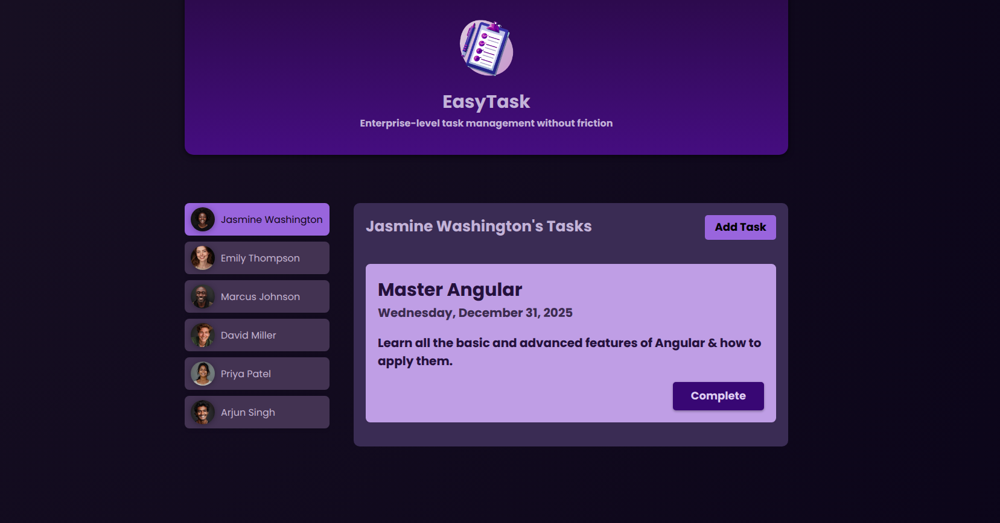
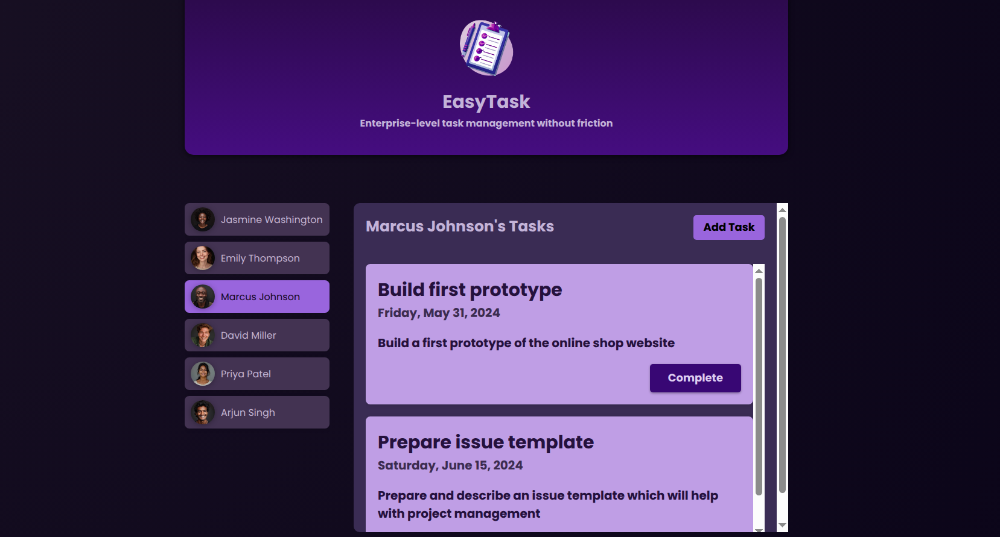
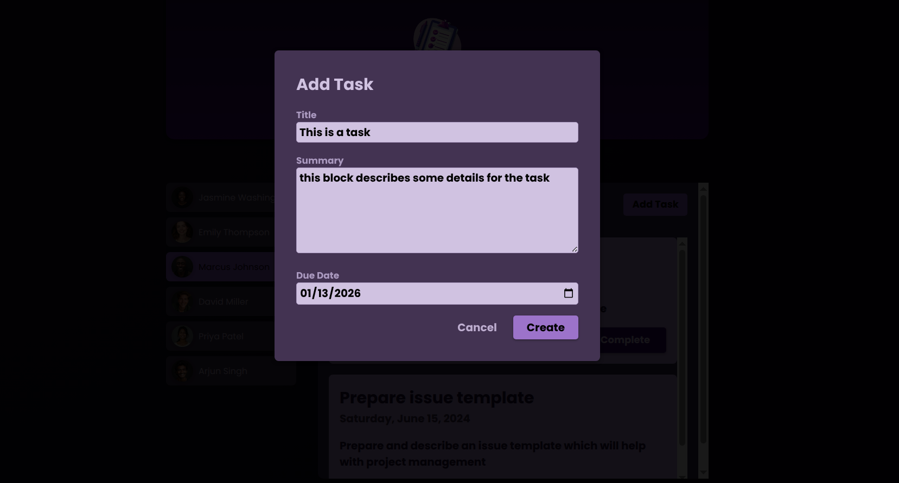

# EasyTask

**Enterprise-level task management without friction**

EasyTask es una aplicación de gestión de tareas construida con Angular que permite administrar tareas de múltiples usuarios de manera eficiente y elegante.

## 📸 Capturas de pantalla

### Pantalla principal

*Interfaz principal mostrando las tareas de Jasmine Washington*

### Gestión de usuarios

*Vista de tareas por usuario - Marcus Johnson*

### Agregar nueva tarea

*Modal para crear nuevas tareas con título, resumen y fecha de vencimiento*

## 🚀 Características

- ✅ Gestión de tareas por usuario
- 📅 Asignación de fechas de vencimiento
- 👥 Múltiples perfiles de usuario
- 🎨 Interfaz moderna con gradientes púrpura
- ✨ Diseño responsive y amigable

## 🛠️ Tecnologías

- Angular CLI version 20.3.10
- TypeScript
- CSS3

## 📦 Instalación

1. Clona el repositorio:
```bash
git clone <url-del-repositorio>
cd EasyTask
```

2. Instala las dependencias:
```bash
npm install
```

## 💻 Desarrollo

Para iniciar el servidor de desarrollo, ejecuta:
```bash
ng serve
```

Navega a `http://localhost:4200/`. La aplicación se recargará automáticamente cuando modifiques cualquier archivo fuente.

## 🏗️ Estructura del proyecto
```
EasyTask/
├── src/
│   ├── app/
│   ├── assets/
│   │   ├── app-images/
│   │   │   ├── add-task.png
│   │   │   ├── index.png
│   │   │   └── users.png
│   │   ├── task-management-logo.png
│   │   └── users/
│   ├── index.html
│   ├── main.ts
│   └── styles.css
├── angular.json
├── package.json
└── README.md
```

## 🔧 Comandos útiles

### Generar componentes
```bash
ng generate component component-name
```

### Construir para producción
```bash
ng build
```

Los archivos compilados se almacenarán en el directorio `dist/`.

### Ejecutar pruebas unitarias
```bash
ng test
```

### Ejecutar pruebas end-to-end
```bash
ng e2e
```

## 📚 Recursos adicionales

Para más información sobre Angular CLI, visita la [documentación oficial de Angular CLI](https://angular.dev/tools/cli).

## 👨‍💻 Autor

Desarrollado con ❤️ usando Angular

## 📄 Licencia

Este proyecto es de código abierto y está disponible bajo la licencia MIT.